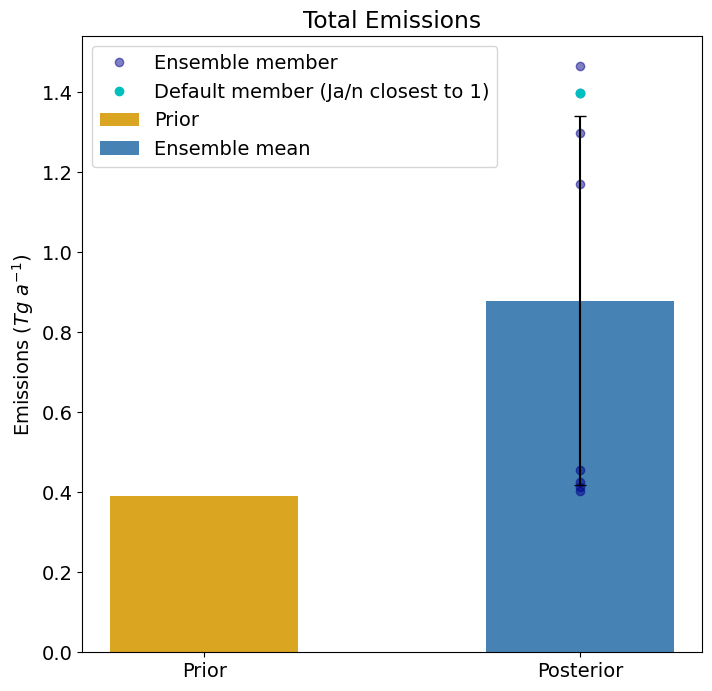
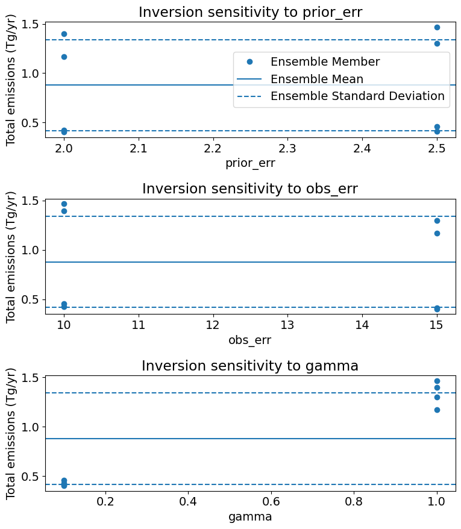

Constructing an inversion ensemble
==================================

You can use the IMI to create a low-cost ensemble of sensitivity inversions with different 
inversion parameters. This is because the Jacobian matrix computed in the first inversion 
can easily be reused for additional  inversions. This can be useful for understanding the 
sensitivity of the inversion results to the choice of prior error, observation error, 
or other inversion parameters.

The IMI has multiple options for creating an inversion ensemble.

1. **Automated ensemble generation**:

The simplest way to generate an ensemble is to run the IMI a single time with
a configuration file that specifies vectors of the desired range of hyperparameters (eg.`PriorError: [0.5, 0.75]`). 
The IMI will then run multiple inversions with the various combinations of hyperparameter values. Each ensemble member is
saved to the `inversion_results_ensemble.nc` and `gridded_posterior_ensemble.nc` file. The ensemble member used for the posterior simulation
is saved to the `inversion_results.nc` and `gridded_posterior.nc` files. This method is useful for quickly generating an ensemble without
having to manually run the IMI multiple times with new run directories and configuration files. However, vectors can only be
applied for the following hyperparameters: `PriorError`, `ObsError`, `Gamma`, `PriorErrorBCs`, `PriorErrorBufferElements`, 
`PriorErrorOH`.

In the ensemble result files (`inversion_results_ensemble.nc` and `gridded_posterior_ensemble.nc`), an additional coordinate is included that
allows selection of the inversion results for each ensemble member. In python, this can be done as follows:

```python
import xarray as xr
ds = xr.open_dataset('inversion_results_ensemble.nc')
# select the inversion results for ensemble member 2
ensemble_member_2 = ds.sel(ensemble=2)

# print the hyperparameters used for ensemble member 2
params = ["prior_err", "obs_err", "gamma", "prior_err_bc", "prior_err_oh", "prior_err_buffer"]
for param in params:
    print(f"{param}: {ensemble_member_2[param]}")
```
The data variables in the default result files (`inversion_results.nc` and `gridded_posterior.nc`) are the inversion results
from the ensemble member that most  closely matches the expected output of the chi-square distribution (:math:`J_a / n \approx 1`) (Lu et al., 2021), 
where :math:`n` is the number of state vector elements. This result is used for the posterior simulation and, if using Kalman Mode, is the ensemble member 
that propogates into the next inversion.

Choosing ensemble members:
~~~~~~~~~~~~~~~~~~~~~~~~~~

The IMI will generate all possible combinations of the hyperparameters specified in the configuration file regardless
of whether some combinations are unrealistic. For example, if you tighten the prior error to a value that is
very low (eg. 0.01) and weight the observations very highly via the regularization parameter (eg. :math:`Gamma > 1`), the inversion will 
have little freedom to update the emissions and would return the prior emissions despite the heavy weighting of the observations.
Therefore, it is important to carefully choose which ensemble members to include in the ensemble analysis. Several visualizations
come built into the visualization notebook that can help users identify which ensemble members are realistic. Once identified, 
unrealistic `ensemble_members` can be removed from the uncertainty analysis. Another metric that can be used to identify unrealistic
ensemble members is the `chi-square` metric. This metric is saved in the inversion_results.nc file and is a measure of how well the
inversion results match the expected output of the chi-square distribution (:math:`J_a / n \approx 1`). Ideally, this value should be
close to 1. If the `chi-square` value is much greater (or less) than 1, it is likely that the inversion results are not realistic and the 
ensemble member should be removed from the uncertainty analysis.

The visualization notebook creates the following figures to analyze the ensemble spread and sensitivity of the inversion results to the hyperparameters:






In this example, you can see from the second figure that the inversion results are highly sensitive to the regularization parameter `Gamma`. As noted above, using a gamma that 
is too low or too high can lead to unrealistic inversion results. Here, we see that the gamma value of 0.1 is too low, causing the inversion to return the prior emissions. 
In this case, it would be reasonable to remove the ensemble members with low gamma from the uncertainty analysis.

2. **Manual ensemble generation**:
In this scenario, you have already run your base inversion. You can then use the IMI to create an ensemble of inversions
by specifying a new run directory that references the precomputed Jacobian matrix from the base run directory.
This method is useful for generating an ensemble with inputs that cannot be specified as vectors in the configuration
file. For example, you may want to run an ensemble of sensitivity inversions that swap out prior emission inventories, 
or use Lognormal instead of Gaussian prior error distributions. Note: When applying state vector clustering you cannot 
use the precomputed Jacobian if you swap out prior emissions inventories. This is because the underlying distribution of 
emissions within individual state vector clusters may change, requiring a new Jacobian matrix to be computed.

See the `Common configurations page <../other/common-configurations.html#running-a-sensitivity-inversion>`__ 
for instructions on how to re-configure the IMI to use a pre-computed Jacobian in a new run directory.
