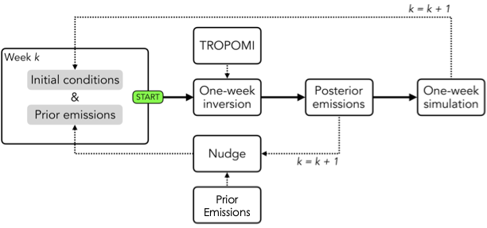
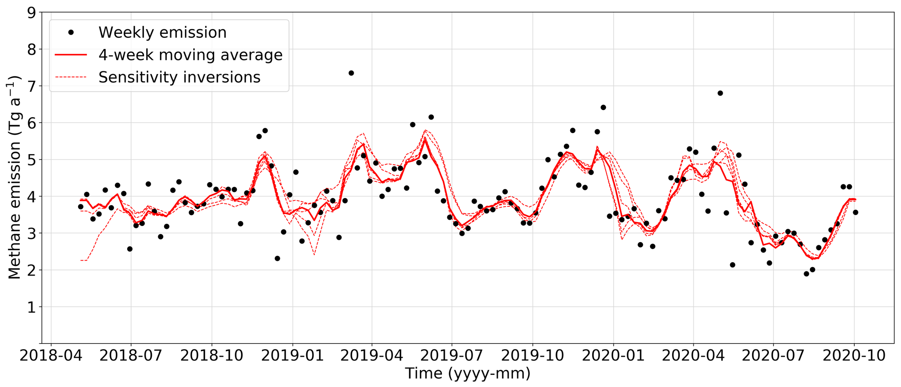

================================
The IMI Kalman Filter mode
================================

What is a Kalman Filter Inversion?
----------------------------------
A Kalman filter is a mathematical algorithm, developed by 
`Rudolf Kalman <https://en.wikipedia.org/wiki/Rudolf_E._K%C3%A1lm%C3%A1n>`_, that estimates the state 
of a system by combining measurements and predictions while considering uncertainties. It operates 
recursively, continuously updating its estimate of the system state based on new measurements.

Kalman filters can be applied in atmospheric inversions by dividing an inversion period into 
smaller time intervals, such as weekly chunks. An inversion is sequentially run for each interval, 
estimating the emissions for that specific period based on measurements and predictions. The 
resulting optimized emissions are then used as prior emissions for the next interval, allowing the 
prior emissions of each successive week to be informed by the previous weeks.

Why use Kalman Filter Mode?
---------------------------
This approach enables tracking of how emissions change over time and provides insights into their 
distribution throughout the inversion period. By using the Kalman filter mode in the inversion, 
users can calculate intermediate emissions at the desired update frequency, such as weekly, revealing 
the temporal evolution of emissions.

How to use the Kalman Filter mode
=================================
The IMI Kalman Mode can be applied simplyy by updating the ``KalmanMode`` config variable to ``true``. 
This will enable the Kalman filter mode using the specified update frequency, nudge factor, and first 
period.

Example Kalman filter config variables:

::

    ## Kalman filter options
    KalmanMode: true
    UpdateFreqDays: 7
    NudgeFactor: 0.1
    FirstPeriod: 1
      
UpdateFreqDays
--------------
The update frequency (``UpdateFreqDays``) is the number of days to for each chunked inversion time 
interval when running the kalman filter. Selecting a shorter update frequency will result in more 
inversion chunks and a longer inversion run time. However, if the observation density per update 
frequency interval you choose is too sparse, the inversion will not constrain emissions effectively. 
Thus, the optimal update frequency will depend on the region of interest and the observation density.
Typically, areas with dense TROPOMI coverage can be updated on a weekly basis.

The NudgeFactor
---------------
A true Kalman Filter would use the posterior emissions from the previous interval as the prior 
emissions for the next interval. However, in practice, a direct substitution of the posterior emissions 
as the prior in the subsequent interval can lead to some emission elements getting locked at very 
low values. Retaining some information from the prior emissions can help to avoid this issue 
(`Varon et al., 2023 <https://acp.copernicus.org/preprints/acp-2022-749/>`_ ). The Kalman filter 
mode in the IMI allows users to specify a nudge factor, which is the fraction of the original emissions 
inventory that is retained in the prior for the next iteration. The rest of the emissions 
(1 - ``NudgeFactor``) come from the posterior emissions of the previous iteration.

FirstPeriod
-----------
The ``FirstPeriod`` config variable allows a user to select which chunked interval they would like 
the Kalman Filter to start on. This is most useful if you have a number of periods succeed eg. 5 out 
of 8 inversion intervals succeed, and you would like to start the Kalman Filter on the 6th period. The 
``FirstPeriod`` variable is set to 1 by default, which means the Kalman Filter will start on the 
first inversion time interval. If you would like to start the Kalman Filter on the 6th period, you would set 
``FirstPeriod`` to 6. The ``FirstPeriod`` variable is a convenience variable, and is not required to 
run the Kalman Filter mode. If you do not specify a ``FirstPeriod``, the Kalman Filter will start on 
the first inversion time interval by default.

Running the Kalman Filter mode
------------------------------
The Kalman Filter mode can be run in the same way as the standard IMI inversion mode. Each step of the
inversion can be toggled on or off based on the config variable toggles 
(eg. ``DoSetup``, ``DoSpinup``). However, in Kalman mode, ``DoJacobian``, ``DoInversion``, 
``DoPosterior`` must all be toggled on or off at the same time because the jacobian, inversion, and 
posterior steps are dependent on each other for each inversion interval. The IMI will print an error 
message if these variables are not toggled in tandem.

Clustering in Kalman Filter mode
--------------------------------
Clustering the state vector in Kalman Filter mode is the same as clustering in standard IMI mode, but 
with one optional, additional feature. By setting the config variable ``DynamicKFClustering`` to 
``true``, the state vector will be updated at each iteration of the Kalman Filter. This is recommended 
for areas with large seasonal differences in observation density to ensure that the clustering algorithm
allocates high resolution state vector elements to areas with enough observations to constrain them.
Generated state vectors at each iteration will be archived in the ``<imi-run-dir>/archive_sv`` directory.
For more information on clustering, see the 
`Clustering options page <../advanced/using-clustering-options>`__.

Visualizing the results of the Kalman Filter
--------------------------------------------
The results of each chunked inversion time interval can be visualized using the standard visualization
notebook located in ``<imi-run-dir>/kf_inversions/period<period_number>/visualization_notebook.ipynb``. 

Additionally, we include another visualization notebook that can be used to visualize the results of
the time series of varying emissions for the entire inversion period. This notebook is located in
``<imi-run-dir>/kf_inversions/kf_notebook.ipynb``.

