.. _quick-start-label:

Quick start guide
=================

1. Register with us
-------------------
We encourage new users to email the IMI team at 
**integrated-methane-inversion@g.harvard.edu** with a 
description of your project and the organization you are affiliated with. Knowing our user base helps us to 
prioritize new features and updates to the IMI. Additionally, registered users can 
`contact us for support <../reference/SUPPORT.html>`__ and will receive notifications of any critical 
bugfixes or new releases/features added to the IMI.

Template introduction email:

.. code-block:: text

  Hello IMI Team!

  My name is <insert name here> and I am affiliated with <insert-organization>. 
  We work on <research-interests> and are interested in using the IMI to <insert-application>. 
  Here is the link to our research page: <insert-link>. Please send us updates on any future 
  releases or critical bugfixes to the IMI.

2. Create an Amazon Web Services (AWS) account
----------------------------------------------

If you do not already have an AWS account, you'll need to sign up for one.
Go to http://aws.amazon.com and click on "Create an AWS Account" in the upper-right corner:

.. figure:: img/create_aws_account.png
  :target: https://aws.amazon.com
  :width: 400 px

You'll need to enter some basic personal information and a credit card number.

Running the IMI is relatively inexpensive (usually on the order of USD $10-$100).
The cost depends on the length of the inversion period, the size of the inversion domain, 
how long you retain your compute instance after completing the inversion, and how you store the final results.

For more information on costs, see :doc:`Tips for Minimizing AWS costs <minimizing-cost-tips>`.

.. note::
  Students can check out subsidized educational credits at https://aws.amazon.com/education/awseducate/.

.. _s3-permissions-label:

3. Add S3 user permissions (Optional Step)
--------------------------

This is an optional step but is recommended if you plan to use S3 for long-term storage of your inversion results.

Amazon Simple Storage Service (S3) is the base storage service on AWS. After running the IMI, you may wish to transfer your output 
data to S3 for persistent storage. If you plan to use S3, you'll need to grant your EC2 instance access to S3.

The easiest way to do this is to grant S3 access to an IAM role.
Attaching the IAM role to a compute instance on the AWS Elastic Compute Cloud (EC2; Amazon's basic computing service) 
will give the EC2 instance full access to S3. 

Instructions to create an IAM role with full S3 access are provided in the 
`GEOS-Chem Cloud Documentation <https://cloud-gc.readthedocs.io/en/latest/chapter03_advanced-tutorial/iam-role.html#create-a-new-iam-role>`_. 
For more information on IAM roles, `check out the AWS Documentation <https://docs.aws.amazon.com/IAM/latest/UserGuide/id_roles.html>`_.

4. Launch an instance with the IMI
----------------------------------

Once you've setup S3 permissions on your AWS account, login to the AWS console and go to the  
`AWS Marketplace IMI listing <https://aws.amazon.com/marketplace/pp/prodview-hkuxx4h2vpjba?sr=0-1&ref_=beagle&applicationId=AWS-Marketplace-Console>`_
(listed for free). This image contains the latest version of the IMI including all required software dependencies on an Amazon Machine Image (AMI).
An AMI fully specifies the software side of your virtual system, including the operating system, software libraries, and default data files. 

On the listing page click "Continue to Subscribe".

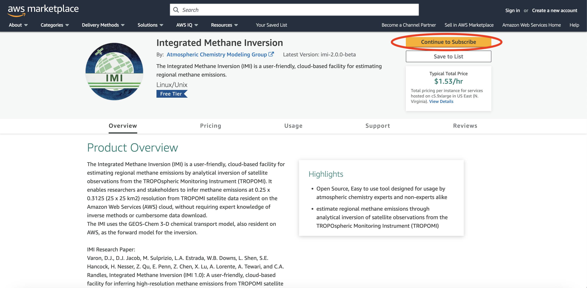

On the following page click "Continue to Configuration".

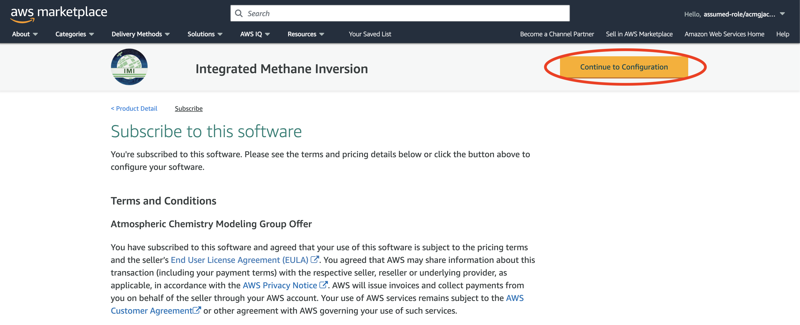

Select desired region and IMI version and click "Continue to Launch". 
Choosing a region closer to your physical location will improve your network connectivity, 
but may result in increased costs compared to using the region where GEOS-Chem data are hosted (us-east-1, N.Virginia).

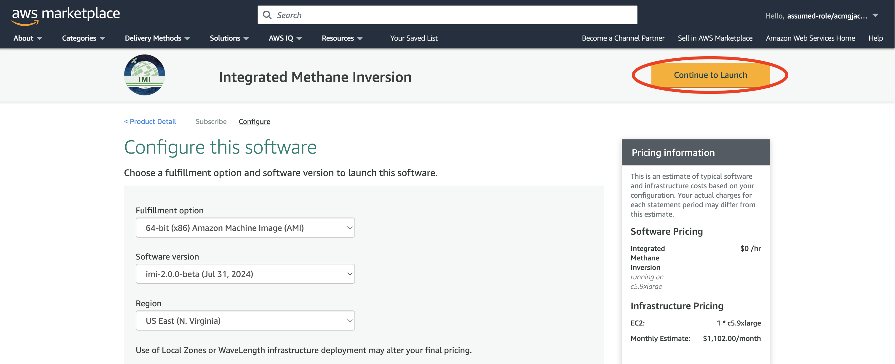

On the launch screen select "Launch through EC2" and then click launch.

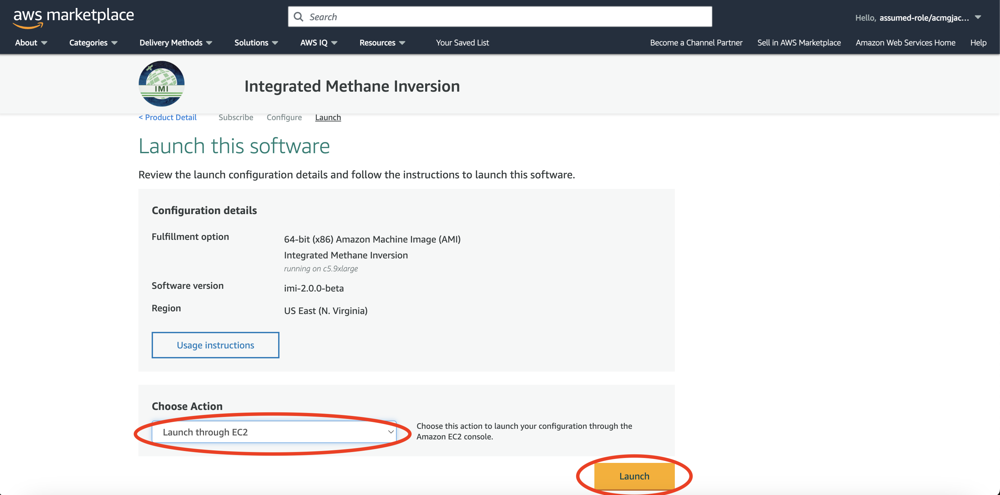

.. _choose_ami-label:

Now it's time to specify the hardware for running your system. Hardware choices differ primarily in CPU and RAM counts. 

You can select from a large number of instance types in the "Instance Type" section. 
The IMI will run more quickly with a higher number of CPUs. 
 
Choose the c5.9xlarge instance type, which includes 36 CPU cores and 72GB of RAM. 
Depending on your use case you may choose a different instance type with more/less cores and memory.

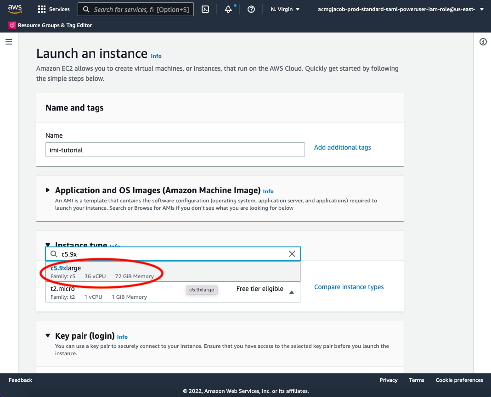

.. note::
  Note: new AWS users may encounter a limit on the number of CPUs they can allocate. To request a limit increase 
  follow the steps outlined in the aws docs on `how to calculate a vCPU limit increase <https://aws.amazon.com/premiumsupport/knowledge-center/ec2-on-demand-instance-vcpu-increase/>`_.

.. _keypair-label:

In the next section you create, or select an existing, ssh key pair. This is equivalent to the password you enter to ``ssh`` to your local server. 
Click "Create new key pair". In the dialog box give your key pair a name (eg. imi_testing) and click "Create key pair".
In the future, you can simply select your existing keypair from the dropdown menu.

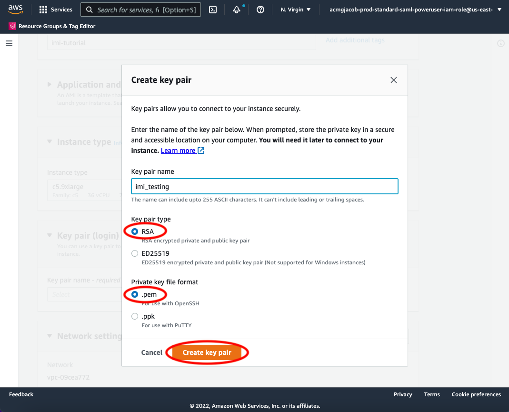

.. _skip-ec2-config-label:

The "Network Settings" section can be left as the defaults. Proceed to "Configure Storage" and select the size of your storage volume. 

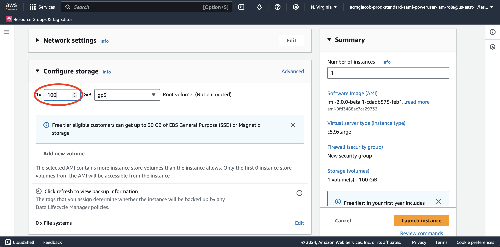

.. note::
  Your storage needs will depend on the length of the inversion period, size of the inversion domain, and the inversion resolution. 
  100GB is generally sufficient for a 1-week inversion (such as for the Permian Basin), and 5 TB will likely be enough for a 1-year inversion.

  Storage costs typically amount to USD $100 per month per TB of provisioned space. 
  See our `advice on selecting storage volume size <minimizing-cost-tips.html#selecting-storage-volume-size>`__ to help minimize storage fees.
  And when your inversion is complete, consider :ref:`copying output data to S3 <s3storage-label>` and 
  :ref:`terminating your EC2 instance <shutdown-label>` to avoid continued storage fees.

Expand the "Advanced Details" section and select the IAM role you created in :ref:`step 3 <s3-permissions-label>` under "IAM Instance Profile".
This ensures that your EC2 instance has access to S3 (for uploading output data).
All other config settings in "Advanced Details" can be left as the defaults.

Note: Editing the advanced details is optional and only necessary if you completed step 3 and plan to use S3 for long-term storage of your inversion results.

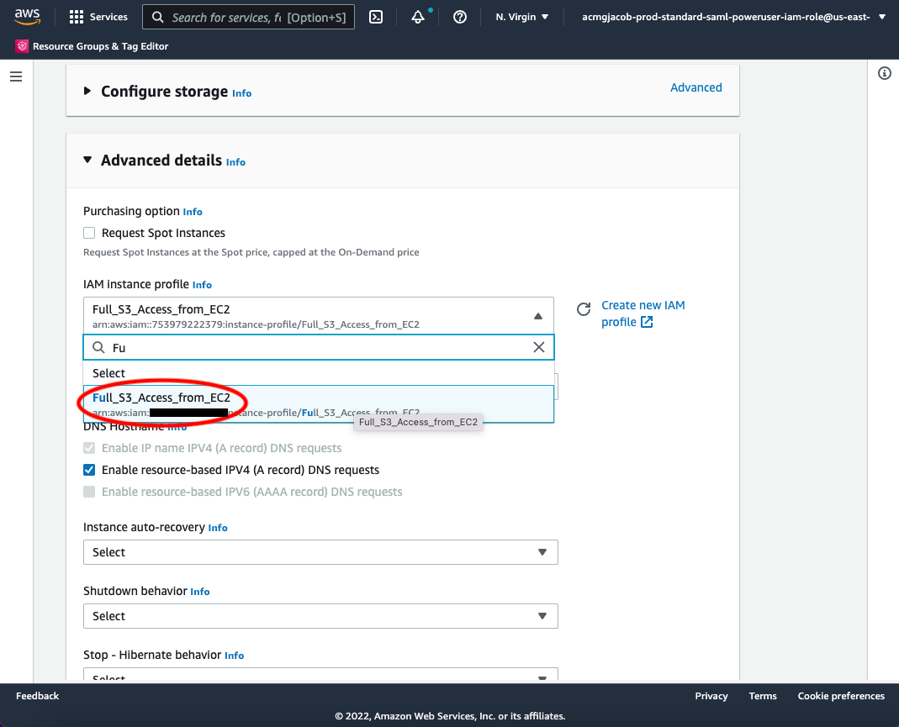

**Then, after reviewing the summary, just click on the "Launch Instance" button.**.
Once launched, you can monitor the instance in the EC2-Instance console as shown below. 
Within one minute of initialization, "Instance State" should show "running" (refresh the page if the status remains "pending"):

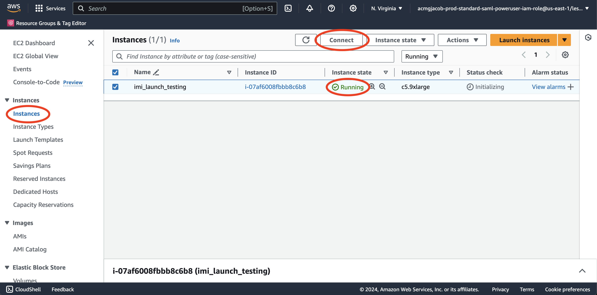

You now have your own system running on the cloud! Note that you will be charged continuously while the instance is running, so make sure to do the 
:ref:`final tutorial step: shutdown the server <shutdown-label>` if you need to pause your work to avoid unnecessary compute charges.

.. _login_ec2-label:

5. Login to your instance
-------------------------

Select your instance and click on the "Connect" button (shown in the figure above) near the blue "Launch Instance" button to show this instruction page:

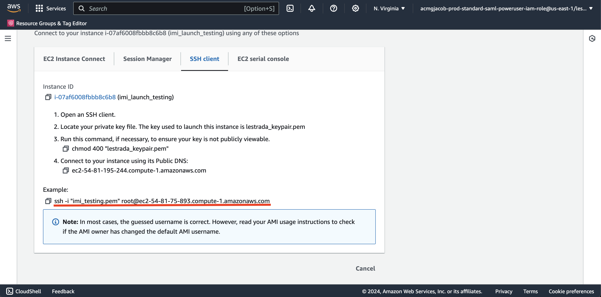

- On Mac or Linux, use the ``ssh -i ...`` command under "Example" to connect to the server in the terminal. Some minor changes are needed:

  (1) ``cd`` to the directory where your Key Pair is stored. People often put the key in ``~/.ssh/`` but any directory will do.
  (2) Use ``chmod 400 your-key-name.pem`` to change the key pair's permission (also mentioned in the above figure; this only needs to be done once).
  (3) **Change the user name in the command from** ``root`` to ``ubuntu`` so that the full command
      looks like ``ssh -i "/path/to/your-key-name.pem" ubuntu@ec2-##-###-##-##.compute-1.amazonaws.com``

- On Windows, you can install `Git-BASH <https://gitforwindows.org>`_ to emulate a Linux terminal. 
  Simply accept all default options during installation, as the goal here is just to use Bash, not Git. 
  Alternatively, you can use `MobaXterm <http://angus.readthedocs.io/en/2016/amazon/log-in-with-mobaxterm-win.html>`_, 
  `Putty <https://docs.aws.amazon.com/AWSEC2/latest/UserGuide/putty.html>`_, 
  `Windows Subsystem for Linux (WSL) <https://docs.aws.amazon.com/AWSEC2/latest/UserGuide/WSL.html>`_, or 
  `PowerShell with OpenSSH <https://blogs.msdn.microsoft.com/powershell/2017/12/15/using-the-openssh-beta-in-windows-10-fall-creators-update-and-windows-server-1709/>`_. 
  The Git-BASH solution should be the most painless, but these other options can work as well. 
  Note: there is a bug on older versions of WSL that can prevent the ``chmod`` command from functioning.

Once you've followed the above instructions, you should see a "Welcome to Ubuntu" message indicating you've logged into your new EC2 instance.

6. Configure the IMI
--------------------

Navigate to the IMI setup directory::

  $ cd ~/integrated_methane_inversion

Open the ``config.yml`` file with vim (``vi``) or emacs::

  $ emacs config.yml

This configuration file contains many settings that you can modify to suit your needs. 
See the :doc:`IMI configuration file page <imi-config-file>` for information on the different settings/options.
Also see the :doc:`common configurations page <../other/common-configurations>`.

7. Run the IMI
--------------
After editing the configuration file, you can run the IMI by executing the following command::
  
  $ sbatch run_imi.sh

The sbatch command runs the IMI and writes to the imi_output.log output file. You can track it's progress by using::
 
  $ tail --follow imi_output.log

The IMI can take minutes to days to complete, depending on the configuration and EC2 instance type. 
You can safely disconnect from your instance during this time, but the instance must remain active in the AWS console.

Alternatively, you can :doc:`run the IMI with tmux <../advanced/running-with-tmux>` to obtain a small to moderate speed-up.

.. note::
  We strongly recommend using the :doc:`IMI preview feature <imi-preview>` before running an inversion.

8. Visualize results with Python
--------------------------------

When your inversion is complete, you can use the visualization notebook provided with the IMI to quickly inspect the results.

First navigate to the inversion directory::

  $ cd /home/ubuntu/imi_output_dir/{YourRunName}/inversion

You can use the ``ls`` command to view the contents of the directory, which will include several scripts, data directories,
and netcdf output files, along with ``visualization_notebook.ipynb``. For more information on the contents, 
see `Contents of the inversion directory <../other/listing-directory-contents.html#inversion-directory>`__.

To set up and connect to a jupyter notebook server on AWS follow `these short instructions <../advanced/setting-up-jupyter.html>`__. 
Once connected to the server, open ``visualization_notebook.ipynb`` and run its contents to display key inversion results 
including the state vector, prior and posterior emissions, TROPOMI data for the region/period of interest, 
averaging kernel sensitivities, and more.

.. _shutdown-label:

9. Shut down the instance
-------------------------

When you are ready to end your session, right-click on the instance in the AWS EC2 console to get this menu:

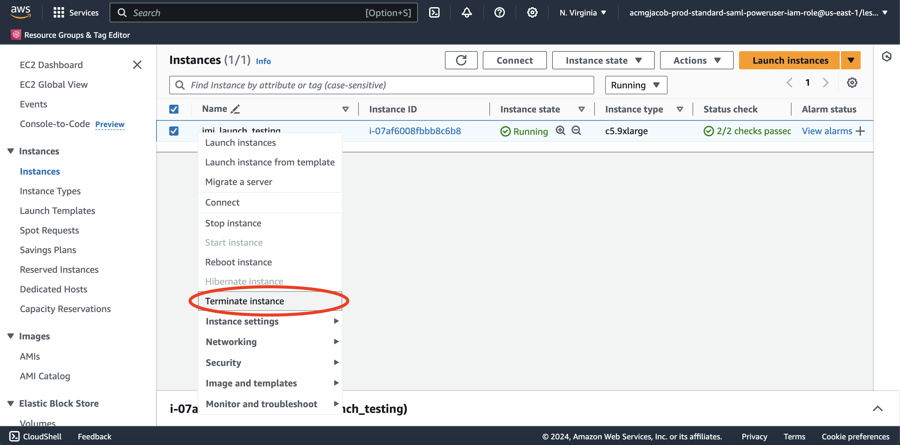

There are two options for ending the session: "Stop instance" (temporary shutdown) or "Terminate instance" (permanent deletion):

- "Stop instance" will make the system inactive. 
  You won't be charged for CPU time, but you will be charged a disk storage fee for the number of GB provisioned on your EC2 instance.
  You can restart the instance at any time and all files will be preserved.
  When an instance is stopped, you can also change its hardware type (right click on the instance -> "Instance Settings" -> "Change Instance Type").
- "Terminate instance" will completely delete the instance so you will incur no further charges.
  Unless you save the contents of your instance as an AMI or transfer the data to another storage service (like S3), you will lose all your data and software.

.. _s3storage-label:

10. Store data on S3
--------------------

S3 is our preferred cloud storage platform due to cost and ease of access. 

You can use the ``cp`` command to copy your output files to an S3 bucket for long term storage::

  $ aws s3 cp </path/to/output/files> s3://<bucket-name> --recursive

For more information on using ``s3`` check out our `tips for exporting data to S3 <minimizing-cost-tips.html#exporting-data-to-s3>`__.
