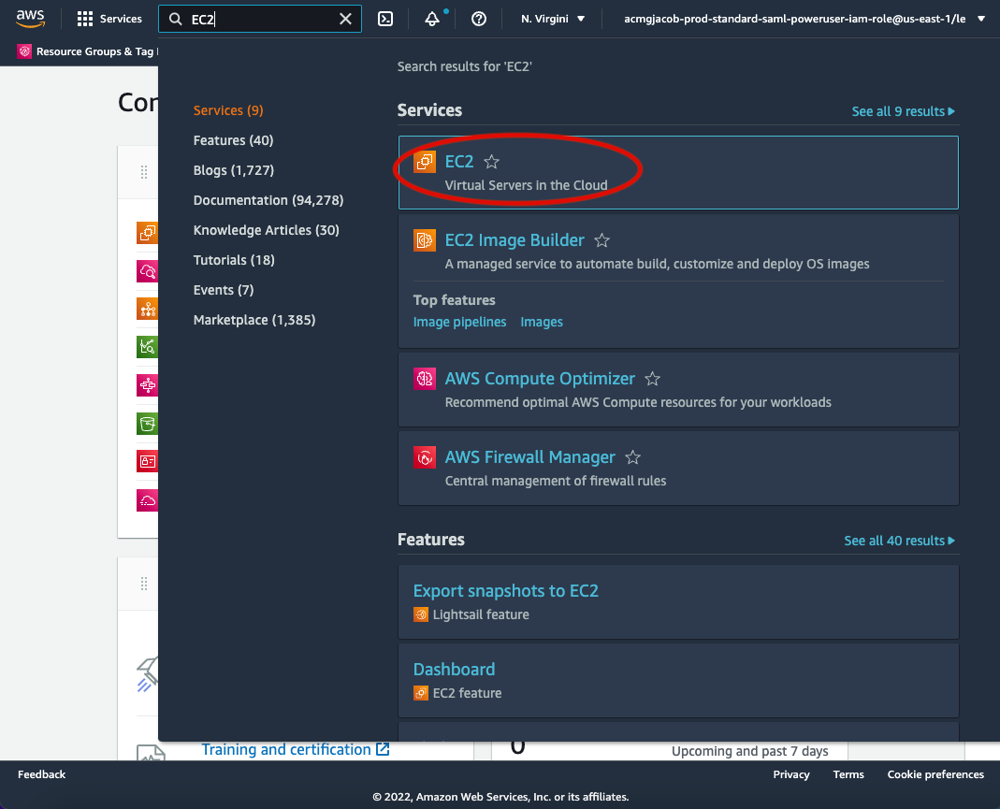

.. _quick-start-label:

Quick start guide
=================

1. Create an Amazon Web Services (AWS) account
----------------------------------------------

If you do not already have an AWS account, you'll need to sign up for one.
Go to http://aws.amazon.com and click on "Create an AWS Account" in the upper-right corner:

.. figure:: img/create_aws_account.png
  :target: https://aws.amazon.com
  :width: 400 px

You'll need to enter some basic personal information and a credit card number.

Running the IMI is relatively inexpensive (usually on the order of USD $10-$100).
The cost depends on the length of the inversion period, the size of the inversion domain, 
how long you retain your compute instance after completing the inversion, and how you store the final results.

For more information on costs, see preview_link_TODO and :doc:`Tips for Minimizing AWS costs <minimizing-cost-tips>`.

.. note::
  Students can check out subsidized educational credits at https://aws.amazon.com/education/awseducate/.

.. _s3-permissions-label:

2. Add S3 user permissions
--------------------------

Default input data for the IMI are stored in the Amazon Simple Storage Service (S3). 
These include TROPOMI methane data, default prior emission estimates, GEOS-Chem meteorological data, and boundary condition data.

The IMI will automatically fetch the data needed for your inversion, but to enable this data transfer 
you'll need to add S3 user permissions to your AWS account.

The easiest way to do this is to grant S3 access to an IAM role.
Attaching the IAM role to a compute instance on the AWS Elastic Compute Cloud (EC2; Amazon's basic computing service) 
will give the EC2 instance full access to S3. 

Instructions to create an IAM role with full S3 access are provided in the 
`GEOS-Chem Cloud Documentation <https://cloud-gc.readthedocs.io/en/latest/chapter03_advanced-tutorial/iam-role.html#create-a-new-iam-role>`_. 
For more information on IAM roles, `check out the AWS Documentation <https://docs.aws.amazon.com/IAM/latest/UserGuide/id_roles.html>`_.

3. Launch an instance with the IMI
----------------------------------

Once you've setup S3 permissions on your AWS account, login to the AWS console and click on EC2.

In the EC2 console, you can see your current selected region in the top right.
Choosing a region closer to your physical location will improve your network connectivity, 
but may result in increased costs compared to using the region where GEOS-Chem data are hosted (us-east-1, N.Virginia).

.. figure:: img/region_list.png
  :width: 300 px

.. _choose_ami-label:

In the EC2 console, click on "AMIs" (Amazon Machine Images) under "IMAGES" on the left navigation bar. 
Then select "Public images" and search for ``TODO:AMI_ID`` or ``TODO:AMI_NAME``.
This image contains the latest version of the IMI including all required software dependencies.

.. figure:: img/search_ami.png

An AMI fully specifies the software side of your virtual system, including the operating system, software libraries, and default data files. 

Now it's time to specify the hardware for running your system. Hardware choices differ primarily in CPU and RAM counts. 

You can select from a large number of instance types at the "Step 2: Choose an Instance Type" screen. 
The IMI will run more quickly with a higher number of CPUs. 
TODO: choose ideal computational node. 
Choose the c5.9xlarge instance type, which includes 36 CPU cores and 72GB of RAM. 
Depending on your use case you may choose a different instance type with more/less cores and memory.

.. figure:: img/choose_instance_type.png

.. _skip-ec2-config-label:

Proceed to Step 3 and select the ``IAM Role`` you created in :ref:`step 2 <s3-permissions-label>`. 
All other config settings in "Step 3: Configuring Instance Details" can be left as the defaults.

.. figure:: img/assign_iam_to_ec2.png

Proceed to "Step 4: Add Storage" and select the size of your storage volume. 

.. note::
  Your storage needs will depend on the length of the inversion period, size of the inversion domain, and the inversion resolution. 
  100GB is generally sufficient for a 1-week inversion (such as for the Permian Basin), and 5 TB will likely be enough for a 1-year inversion.

  Storage costs typically amount to USD $100 per month per TB of provisioned space. 
  See our `advice on selecting storage volume size <minimizing-cost-tips.rst#selectingStorageSize-label>`__ to help minimize storage fees.
  And when your inversion is complete, consider :ref:`copying output data to S3 <s3storage-label>` and 
  :ref:`terminating your EC2 instance <shutdown-label>` to avoid continued storage fees.

**Then, just click on "Review and Launch".** You don't need to touch other options this time. 
This brings you to "Step 7: Review Instance Launch". Click on the Launch button again.

.. _keypair-label:

When you first use EC2, you will be asked to create and download a file called a "Key Pair". 
It is equivalent to the password you enter to ``ssh`` to your local server.

Give your "Key Pair" a name, click on "Download Key Pair", and finally click on "Launch Instances". 
In the future, you can simply select "Choose an existing Key Pair", select your previously created Key Pair, and launch.

.. figure:: img/key_pair.png
  :width: 500 px

Once launched, you can monitor the instance in the EC2-Instance console as shown below. 
Within one minute of initialization, "Instance State" should show "running" (refresh the page if the status remains "pending"):

.. figure:: img/running_instance.png

You now have your own system running on the cloud! Note that you will be charged continuously while the instance is running, so make sure to do the 
:ref:`final tutorial step: shutdown the server <shutdown-label>` if you need to pause your work to avoid unnecessary compute charges.

.. _login_ec2-label:

4. Login to your instance
-------------------------

Select your instance and click on the "Connect" button (shown in the figure above) near the blue "Launch Instance" button to show this instruction page:

.. figure:: img/connect_instruction.png
  :width: 500 px

- On Mac or Linux, use the ``ssh -i ...`` command under "Example" to connect to the server in the terminal. Some minor changes are needed:

  (1) ``cd`` to the directory where your Key Pair is stored. People often put the key in ``~/.ssh/`` but any directory will do.
  (2) Use ``chmod 400 your-key-name.pem`` to change the key pair's permission (also mentioned in the above figure; this only needs to be done once).
  (3) Change the user name in the command from ``root`` to ``ubuntu`` so that the full command
      looks like ``ssh -i "your-key-name.pem" ubuntu@ec2-##-###-##-##.compute-1.amazonaws.com``

- On Windows, you can install `Git-BASH <https://gitforwindows.org>`_ to emulate a Linux terminal. 
  Simply accept all default options during installation, as the goal here is just to use Bash, not Git. 
  Alternatively, you can use `MobaXterm <http://angus.readthedocs.io/en/2016/amazon/log-in-with-mobaxterm-win.html>`_, 
  `Putty <https://docs.aws.amazon.com/AWSEC2/latest/UserGuide/putty.html>`_, 
  `Windows Subsystem for Linux (WSL) <https://docs.aws.amazon.com/AWSEC2/latest/UserGuide/WSL.html>`_, or 
  `PowerShell with OpenSSH <https://blogs.msdn.microsoft.com/powershell/2017/12/15/using-the-openssh-beta-in-windows-10-fall-creators-update-and-windows-server-1709/>`_. 
  The Git-BASH solution should be the most painless, but these other options can work as well. 
  Note: there is a bug on older versions of WSL that can prevent the ``chmod`` command from functioning.

Once you've followed the above instructions, you should see a "Welcome to Ubuntu" message indicating you've logged into your new EC2 instance.

5. Configure the IMI
--------------------

Navigate to the IMI setup directory::

  $ cd ~/setup_CH4

Open the ``config.yml`` file with vim (``vi``) or emacs::

  $ emacs setup_ch4_inversion.sh

This configuration file contains many settings that you can modify to suit your needs. 
See the :doc:`IMI configuration file page <imi-config-file>` for information on the different settings/options.

6. Run the IMI
--------------
After editing the configuration file, you can run the IMI by executing the following command:
  
  $ sbatch run_ch4_inversion.sh

The IMI can take minutes to days to complete, depending on the configuration and EC2 instance type. 
You can safely disconnect from your instance during this time, but the instance must remain active in the AWS console.

Alternatively, you can :doc:`run the IMI with tmux <../advanced/running-with-tmux>` to obtain a small to moderate speed-up.

.. note::
  We **strongly** recommend using the :doc:`IMI preview feature <imi-preview>` before running an inversion.

7. Visualize results with Python
--------------------------------

TODO

.. _shutdown-label:

8. Shut down the instance
-------------------------

When you are ready to end your session, right-click on the instance in the AWS EC2 console to get this menu:

.. image:: img/terminate.png

There are two options for ending the session: "Stop" (temporary shutdown) or "Terminate" (permanent deletion):

- "Stop" will make the system inactive. 
  You won't be charged for CPU time, but you will be charged a disk storage fee for the number of GB allocated to your EC2 instance.
  You can restart the server at any time and all files will be preserved.
  When an instance is stopped, you can also change its hardware type (right click on the instance -> "Instance Settings" -> "Change Instance Type").
- "Terminate" will completely delete the instance so you will incur no further charges.
  Unless you save your system as an AMI or transfer the data to another storage service (like S3), you will lose all your data and software.

.. _s3storage-label:

9. Store data on S3
-------------------

S3 is our preferred cloud storage platform due to cost and ease of access. 

You can use the ``cp`` command to copy your output files to an S3 bucket for long term storage::

  $ aws s3 cp </path/to/output/files> s3://<bucket-name> --recursive

For more information on using ``s3`` check out our `tips for exporting data to S3 <minimizing-cost-tips.rst#exportingS3-label>`__.