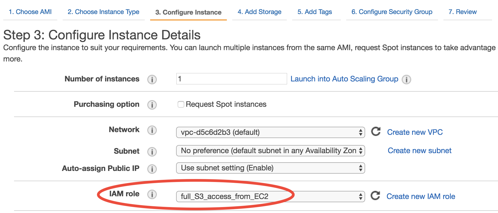

.. _quick-start-label:

Quick start guide
=================


1. Create an Amazon Web Services (AWS) account
----------------------------------------------

If you do not already have an AWS account, you'll need to sign up for one.
Go to http://aws.amazon.com and click on "Create an AWS Account" in the upper-right corner:

.. figure:: img/create_aws_account.png
  :target: https://aws.amazon.com
  :width: 400 px

You'll need to enter some basic personal information and a credit card number. 
Running the IMI is relatively inexpensive (usually on the order of USD $10-$100).
The cost depends on the length of the inversion period, the size of the inversion domain, 
how long you retain your Cloud instance after completing the inversion, and how you store the final results.
(For more information on the latter two points, see :doc:`Tips for Minimizing AWS costs <minimizing-cost-tips>`.)

.. note::
  Students can check out subsidized educational credits at https://aws.amazon.com/education/awseducate/.
  

2. Add S3 user permissions
--------------------------

Default input data for the IMI are stored in the Amazon Simple Storage Service (S3). 
These include TROPOMI methane data, default prior emission estimates, GEOS-Chem meteorological data, and boundary condition data.
The IMI will automatically fetch the data needed for your inversion, but to enable this data retrieval, 
you need to grant S3 download permissions to a user in your AWS account.


The easiest way to enable data transfer from and to S3 is to grant S3 access to an IAM role.
When attached to a compute instance on the AWS Elastic Compute Cloud (EC2; Amazon's basic computing service), 
the IAM role will give that EC2 instance full access to S3. 
Instructions to create an IAM role with full S3 access are available at `this link to the GEOS-Chem Documentation <https://cloud-gc.readthedocs.io/en/latest/chapter03_advanced-tutorial/iam-role.html#create-a-new-iam-role>`_. 
For more information on IAM roles, `check out the AWS Documentation <https://docs.aws.amazon.com/IAM/latest/UserGuide/id_roles.html>`_.


3. Launch an instance with the IMI Workflow pre-installed
---------------------------------------------------------

Once you've setup S3 permissions on your AWS account, login to the AWS console and click on EC2.

.. figure:: img/main_console.png
  :width: 600 px

In the EC2 console, you can see your current selected region in the top right.
Choosing a region closer to your physical location will improve your network connectivity, but may result in increased costs compared to using the region where GEOS-Chem data are hosted (us-east-1 (N.Virginia)).

.. figure:: img/region_list.png
  :width: 300 px

.. _choose_ami-label:

In the EC2 console, click on "AMIs" (Amazon Machine Images) under "IMAGES" on the left navigation bar. Then select "Public images" and search for ``TODO:AMI_ID`` or ``TODO:AMI_NAME``.
This image contains the latest version of the IMI Workflow and has all the necessary software dependencies preinstalled.

.. figure:: img/search_ami.png

An AMI fully specifies the software side of your virtual system, including the operating system, software libraries, and default data files. 
Now it's time to specify the hardware for running your system. Hardware choices differ primarily in CPU and RAM counts. 

You can select from a large number of instance types at the "Step 2: Choose an Instance Type" screen. The IMI Workflow will run more quickly with a higher number of CPUs. 
TODO: choose ideal computational node. Choose the c5.9xlarge instance type, which includes 36 CPU cores and 72GB of RAM. Depending on your use case you may choose to use a different instance type that provides more/less cores and memory.

.. figure:: img/choose_instance_type.png

.. _skip-ec2-config-label:


Proceed to Step 3 and select the ``IAM Role`` you created in `step 2 <2. Add S3 user permissions so you can download input data>`_. All other config settings in Step 3: Configuring Instance Details can be left as the defaults.



Proceed to "Step 4: Add Storage" and select the size of your storage volume. Your needs will depend on the length and resolution of your inversion. For example, for a 1 week inversion 100GB is sufficient. Note that your storage costs will be based on this value. You can always add storage space after your EC2 instance is launched, but it is very difficult to shrink volume size, so it is best to start conservative if you plan to keep the instance for a significant time period (more than a few days).


**Then, just click on "Review and Launch".** You don't need to touch other options this time. This brings you to "Step 7: Review Instance Launch". Click on the Launch button again.

.. _keypair-label:

When you first use EC2, you will be asked to create and download a file called a "Key Pair". It is equivalent to the password you enter to ``ssh`` to your local server.

Give your "Key Pair" a name, click on "Download Key Pair", and finally click on "Launch Instances". In the future, you can simply select "Choose an existing Key Pair", select your previously created Key Pair, and launch.

.. figure:: img/key_pair.png
  :width: 500 px


Once launched, you can monitor the instance in the EC2-Instance console as shown below. Within < 1min of initialization, "Instance State" should become "running" (refresh the page if the status stays as "pending"):


You now have your own system running on the cloud! Note that you will be charged every hour that you leave this instance running, so make sure to do the 
:ref:`final tutorial step: shutdown the server <shutdown-label>` if you need to pause your work to avoid being charged continuously.

.. _login_ec2-label:

4. Login to your instance
-------------------------

Select your instance, click on the "Connect" button (shown in the above figure) near the blue "Launch Instance" button, then you should see this instruction page:

.. figure:: img/connect_instruction.png
  :width: 500 px

- On Mac or Linux, use the ``ssh -i ...`` command under "Example" to connect to the server in the terminal. Some minor changes are needed:

  (1) ``cd`` to the directory where your Key Pair is stored (people often put the key in ``~/.ssh/`` but any directory is fine.)
  (2) Use ``chmod 400 your-key-name.pem`` to change the key pair's permission (also mentioned in the above figure; only need to do this the first time you login).
  (3) Change the user name in that command from ``root`` to ``ubuntu``, so the full command will be like ``ssh -i "your-key-name.pem" ubuntu@xxx.amazonaws.com``

- On Windows, you can install `Git-BASH <https://gitforwindows.org>`_ to emulate a Linux terminal. Simply accept all default options during installation, as the goal here is just to use Bash, not Git. 
  Alternatively, you can use `MobaXterm <http://angus.readthedocs.io/en/2016/amazon/log-in-with-mobaxterm-win.html>`_, `Putty <https://docs.aws.amazon.com/AWSEC2/latest/UserGuide/putty.html>`_, `Windows Subsystem for Linux (WSL) <https://docs.aws.amazon.com/AWSEC2/latest/UserGuide/WSL.html>`_ or `PowerShell with OpenSSH <https://blogs.msdn.microsoft.com/powershell/2017/12/15/using-the-openssh-beta-in-windows-10-fall-creators-update-and-windows-server-1709/>`_. The Git-BASH solution should be the most painless, but these other options should work as well. Note: there is a bug on older versions of WSL that can prevent the ``chmod`` command from functioning.


Once you've followed the above instructions, you should see a "Welcome to Ubuntu" message indicating you've logged into your new EC2 instance.


5. Configure and run the IMI Workflow
-------------------------------------

Navigate to the IMI Workflow setup directory::

  $ cd ~/setup_CH4

Open the ``config.yml`` file with vim or emacs::

  $ emacs setup_ch4_inversion.sh


This file contains many settings you can modify according to your scientific needs. A detailed explanation of all configuration values can be read at the `IMI config file page <imi-config-file>`_.

6. Running the Automated Workflow
---------------------------------
After you have edited the config file to your desired workflow settings, run the workflow by executing the following command in ``~/setup_CH4``:
  
  $ ./run_ch4_inversion.sh

This will kick off the workflow. This can take significant time to complete depending on the length and settings specified in the configuration file. Note: You must remain logged in for the duration of the inversion. For long running inversions you can run the workflow with tmux, see `using tmux to run the workflow <running-with-tmux>`_.

`Click here <manual-running>`_ for instructions on manually running each step of the workflow (an alternative to using the automated workflow run script).


7. Analyze output data with Python
----------------------------------

TODO


.. _shutdown-label:

8. Shut down the instance
-------------------------

If you're done using your instance for awhile or don't plan on using it again, you should either shutdown or terminate your instance. 
Shutting down or terminating your instance will minimize or completely stop, respectively, new charges to your account.


Right-click on the instance in your console to get this menu:

.. image:: img/terminate.png

You have two options now, "Stop" to shutdown or "Terminate" to completely delete your instance:

- "Stop" will make the system inactive. You won't be charged for CPU time, but you will be charged a disk storage fee for the number of GB allocated to your EC2 instance. You can restart the server at any time and all files will be preserved. When an instance is stopped, you can also change its hardware type (right click on the instance -> "Instance Settings" -> "Change Instance Type") 
- "Terminate" will completely remove that instance so you won't be charged for it any further.
  Unless you save your system as an AMI or transfer the data to other storage services, you will lose all your data and software.

9. Storing Data on S3:
S3 is our preferred cloud storage platform due to cost and ease of access. You can use the ```cp``` command to copy your output files to your desired S3 bucket for long term storage::

  $ aws s3 cp </path/to/output/files> s3://<bucket-name> --recursive

For more information on using s3 check out the `Exporting Data to S3 <https://integrated-methane-inversion.readthedocs.io/en/docs-update/getting-started/minimizing-cost-tips.html#exporting-data-to-s3>` section.